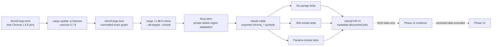

# Phase 11: Migrate Rust shim from Chroma 1.5.5 to 1.5.9 - Research

**Researched:** 2026-08-02
**Domain:** Rust/Cargo dependency migration, stable C ABI, Go `purego`, JNA, and Panama integration
**Confidence:** HIGH

<user_constraints>
## User Constraints (from CONTEXT.md)

### Locked Decisions

## Implementation Decisions

### Additive Chroma 1.5.9 APIs
- **D-01:** Defer all explicit additive upstream APIs: collection lookup by UUID, `fork_count`, `ReadLevel::IndexAndBoundedWal`, sparse-index selection, and MaxScore controls.
- **D-02:** Keep default-compatible raw YAML/schema parsing, but add no new C, Go, JNA, or Panama typed API surface in this phase.

### Embedded delete region
- **D-03:** Pass `String::new()` for the new `Frontend::delete(request, region)` argument in local embedded mode. This is private shim state and must not change C, Go, JNA, or Panama calls.
- **D-04:** Add a real embedded delete regression that verifies deleted and remaining records; the region itself is telemetry-only and not externally observable.

### Dependency and toolchain contract
- **D-05:** Update all nine Chroma tags together, then explicitly run `cargo update -p fastrace --precise 0.7.8`. Treat the generated lockfile as a dependency migration and inspect it; never use an unconstrained `cargo update`.
- **D-06:** Adopt the hybrid toolchain policy established by the validated spikes: Rust 1.88.0 is the source-build MSRV, Rust 1.93.1 remains the exact CI/release pin, and `protoc` 31.1 is the source-build generator requirement. Prebuilt-library consumers need neither Rust nor `protoc`.
- **D-07:** Revalidate `cargo +1.88.0 check --all-targets --locked` whenever the committed lockfile changes materially.

### Verification boundary
- **D-08:** Phase 11 requires fresh-data validation and a green normal PR CI matrix. That matrix already exercises Linux, macOS, and Windows, but it must not be described as proof that existing 1.5.5 data upgrades safely.
- **D-09:** Phase 12 remains the release gate for cross-version persisted-data, mutation/reopen, maintenance, and binding compatibility evidence.

### the agent's Discretion
- Exact Cargo command sequencing and how lockfile/duplicate-package review is presented in plan tasks.
- Whether the measured MSRV is encoded in `shim/Cargo.toml`, a dedicated CI check, or both, provided the public documentation and locked validation remain aligned.
- Exact test data and assertions for the embedded delete regression.

### Deferred Ideas (OUT OF SCOPE)

## Deferred Ideas

- **Phase 13: Expose deferred Chroma 1.5.9 APIs with backward-compatible Go, JNA, and Panama bindings.** It owns any future cross-language wrapper API for UUID collection lookup, `fork_count`, bounded-WAL reads, sparse-index algorithms, and MaxScore controls.
</user_constraints>

<phase_requirements>
## Phase Requirements

| ID | Description | Research Support |
|----|-------------|------------------|
| UPG-01 | All nine direct Chroma Rust dependencies and the resolved lockfile use the Chroma 1.5.9 dependency graph | Use one manifest group edit, the locked package-specific `fastrace` update, then verify the resolved graph semantically through Cargo metadata. |
| UPG-02 | The shim adapts the changed `Frontend::delete` region argument with documented local-mode semantics and no behavior change through the existing FFI | Keep `String::new()` private to `run_embedded_delete_records`; test deletion and survivor retrieval through Go → C ABI → Rust. |
| UPG-03 | Existing exported C symbols and public Go, JNA, and Panama APIs remain backward compatible; additive APIs are explicitly included or deferred | Capture the pre-migration native symbol set, compare the rebuilt library, run Go plus both Java binding suites, and record D-01/D-02 deferrals. |
| UPG-04 | Rust and protobuf toolchain guidance matches the versions actually required to build the locked Chroma 1.5.9 graph | Lock the measured Rust 1.88.0 check, retain Rust 1.93.1 in CI/release, document `protoc` 31.1 for source builders only. |
</phase_requirements>

## Project Constraints (from AGENTS.md)

- Preserve the no-`cgo` design and keep Rust/C FFI signatures synchronized with their consumers. [VERIFIED: AGENTS.md]
- Keep public APIs backward compatible unless the user explicitly requests a breaking change; add or update tests for behavior changes. [VERIFIED: AGENTS.md]
- Preserve `Stop`, `Close`, and finalizer cleanup behavior. [VERIFIED: AGENTS.md]
- Prefer repository Make targets: `make build`, `make test`, `make test-rust`, `make test-java`, and `make lint`; record precisely any relevant check that cannot run. [VERIFIED: AGENTS.md]
- The project build/runtime baseline is Go 1.21+, while Java bindings require Java 17+ (JNA) and Java 22+ (Panama). [VERIFIED: AGENTS.md]
- Use squash merge for any eventual merge and never include prohibited internal-repository information in commits, PRs, or related artifacts. [VERIFIED: AGENTS.md]
- No project-local `.codex/skills/` or `.agents/skills/` directory was present during research, so there are no additional project skill rules to apply. [VERIFIED: filesystem scan]

## Summary

Phase 11 is a deliberately narrow dependency migration: move the nine direct Chroma git dependencies together to tag `1.5.9`, reconcile the known `fastrace` exact-version conflict with a package-specific Cargo update, and make one private `Frontend::delete(request, String::new())` call adaptation. The phase must not expose new Chroma APIs or change C, Go, JNA, or Panama signatures. [VERIFIED: 11-CONTEXT.md; VERIFIED: shim/Cargo.toml; VERIFIED: shim/src/lib.rs]

The reliable evidence is behavior and build output, not formatting-sensitive `awk`/`rg` source checks. Cargo's JSON metadata can prove every expected Chroma package resolves from the intended git source under `--locked`; a before/after dynamic-library symbol comparison proves the exported C set did not drift; and the existing `make test-java` target builds the shim then runs both Java backends with `CHROMA_LIB_PATH` set to that rebuilt library. [CITED: https://doc.rust-lang.org/cargo/commands/cargo-metadata.html; VERIFIED: Makefile; VERIFIED: shim/src/lib.rs]

**Primary recommendation:** Plan one constrained lockfile migration, one private delete adaptation plus real end-to-end regression, and one compatibility-validation task that captures C symbols, runs Rust/Go/JNA/Panama fresh-data tests, and records CI evidence through an authenticated-or-manual path. [VERIFIED: 11-CONTEXT.md; VERIFIED: 11-REVIEWS.md]

## Architectural Responsibility Map

| Capability | Primary Tier | Secondary Tier | Rationale |
|------------|-------------|----------------|-----------|
| Resolve Chroma 1.5.9 graph | Build/dependency system | Rust shim | Cargo owns the exact dependency graph; the shim declares the nine direct crates. [VERIFIED: shim/Cargo.toml; CITED: https://doc.rust-lang.org/cargo/commands/cargo-update.html] |
| Adapt changed delete call | Rust shim / FFI implementation | — | The only known source change is behind the existing exported delete functions. [VERIFIED: shim/src/lib.rs; VERIFIED: 11-CONTEXT.md] |
| Preserve exported ABI | Native dynamic library | Go/JNA/Panama bindings | One `cdylib` is loaded by all binding tiers, so its `chroma_*` exports are the shared contract. [VERIFIED: shim/Cargo.toml; VERIFIED: internal/runtime/chroma.go; VERIFIED: Makefile] |
| Prove fresh-data behavior | Binding integration tests | CI | Tests exercise native calls from Go, JNA, and Panama; CI repeats this on three OS runners. [VERIFIED: Makefile; VERIFIED: .github/workflows/ci.yml] |
| Prove persisted-data upgrade | Phase 12 | — | The locked boundary explicitly reserves existing-data migration, reopen, and maintenance proof for Phase 12. [VERIFIED: 11-CONTEXT.md; VERIFIED: REQUIREMENTS.md] |

## Standard Stack

### Core

| Library/tool | Version | Purpose | Why Standard |
|--------------|---------|---------|--------------|
| Chroma direct Rust crates | git tag `1.5.9` | Embedded Chroma server/frontend implementation | The shim already directly consumes these nine official Chroma crates, so synchronized git-tag pins preserve its existing integration model. [VERIFIED: shim/Cargo.toml; CITED: https://github.com/chroma-core/chroma/releases/tag/1.5.9] |
| Cargo | package-specific `update -p fastrace --precise 0.7.8`; `--locked` validation | Constrained resolution and reproducible builds | Cargo documents package-specific updates as conservative and `--locked` as rejecting lockfile changes. [CITED: https://doc.rust-lang.org/cargo/commands/cargo-update.html] |
| Rust | 1.88.0 MSRV; 1.93.1 CI/release pin | Source compilation | The two validated project spikes measured 1.88.0 for the targeted graph and lock 1.93.1 for CI/release reproducibility. [VERIFIED: .planning/spikes/002-chroma-1-5-9-toolchain-floor/README.md; VERIFIED: .github/workflows/ci.yml; VERIFIED: .github/workflows/release.yml] |
| `protoc` | 31.1 for source builds | Protobuf code generation required by the Rust graph | The project CI/release setup downloads and checks 31.1; prebuilt consumers do not compile the shim. [VERIFIED: .github/workflows/ci.yml; VERIFIED: .github/workflows/release.yml; VERIFIED: 11-CONTEXT.md] |

### Supporting

| Library/tool | Version | Purpose | When to Use |
|--------------|---------|---------|-------------|
| `jq` | any compatible JSON processor | Evaluate Cargo metadata structurally | Use in the migration verification command to prove all nine resolved packages use the expected source, rather than matching Cargo.lock formatting. [CITED: https://doc.rust-lang.org/cargo/commands/cargo-metadata.html; VERIFIED: local environment `jq 1.8.2`] |
| platform symbol inspector | `nm` on POSIX; `llvm-nm`/`dumpbin` on Windows | Read the native library's exported `chroma_*` symbols | Capture a pre-migration baseline and compare it to the rebuilt native library before binding tests. [VERIFIED: local `nm`; ASSUMED: Windows inspector availability in all execution environments] |
| Gradle/JUnit | existing project configuration | Execute JNA and Panama suites against the rebuilt shim | Use `make test-java`, which first invokes the debug shim build and then runs `:jna:test` and `:panama:test`. [VERIFIED: Makefile; VERIFIED: java/build.gradle.kts] |

### Alternatives Considered

| Instead of | Could Use | Tradeoff |
|------------|-----------|----------|
| Cargo metadata JSON check | Text counting/matching in `Cargo.toml` and `Cargo.lock` | Do not use format-dependent checks; metadata reports the resolved package names and sources in a documented machine-readable format. [CITED: https://doc.rust-lang.org/cargo/commands/cargo-metadata.html; VERIFIED: 11-REVIEWS.md] |
| Before/after native symbol comparison | Source-only `#[no_mangle]` grep | Do not rely on source-only inspection; it cannot prove the rebuilt `cdylib` exports the intended symbols. [VERIFIED: shim/Cargo.toml; VERIFIED: 11-REVIEWS.md] |
| API expansion | No new bindings in Phase 11 | D-01/D-02 lock additive APIs to Phase 13, keeping this phase compatible and small. [VERIFIED: 11-CONTEXT.md] |

**Installation:** No new package is to be installed by this phase. The phase changes existing, official Chroma git pins only. [VERIFIED: 11-CONTEXT.md; VERIFIED: shim/Cargo.toml]

## Package Legitimacy Audit

No new external package installation is recommended. The migration updates existing direct dependencies that point at Chroma's official repository and tag; therefore a package-install audit is not applicable. [VERIFIED: shim/Cargo.toml; CITED: https://github.com/chroma-core/chroma/releases/tag/1.5.9]

## Architecture Patterns

### System Architecture Diagram



The diagram shows the required evidence chain: resolve, compile, build, compare ABI, run every binding tier, then obtain remote fresh-data evidence. Persisted-data claims do not flow from any Phase 11 result. [VERIFIED: 11-CONTEXT.md; VERIFIED: Makefile; VERIFIED: .github/workflows/ci.yml]

### Recommended Project Structure

```text
shim/
├── Cargo.toml                 # nine synchronized Chroma pins and Rust MSRV declaration
├── Cargo.lock                 # generated, committed resolved graph
└── src/lib.rs                 # private Frontend::delete region adaptation and C exports
internal/runtime/
└── embedded_integration_edge_test.go  # Go → C → Rust delete/survivor regression
java/
├── jna/                       # Java 17 smoke suite
└── panama/                    # Java 22 smoke suite
```

This uses existing ownership boundaries; no new wrapper layer, FFI symbol, or package is needed. [VERIFIED: AGENTS.md; VERIFIED: Makefile]

### Pattern 1: Constrained, semantic lockfile migration

**What:** Change all nine manifest pins in one edit, run the one package-specific resolver command, then query the resolved graph with `cargo metadata --locked --format-version=1`. [VERIFIED: 11-CONTEXT.md; CITED: https://doc.rust-lang.org/cargo/commands/cargo-update.html; CITED: https://doc.rust-lang.org/cargo/commands/cargo-metadata.html]

**When to use:** Every time the committed migration changes `shim/Cargo.lock`. [VERIFIED: 11-CONTEXT.md]

**Example:**

```bash
# Source: Cargo update + cargo metadata documentation
cargo update --manifest-path shim/Cargo.toml -p fastrace --precise 0.7.8

expected='["chroma-frontend","chroma-config","chroma-system","chroma-types","chroma-log","chroma-index","chroma-segment","chroma-sysdb","chroma-sqlite"]'
cargo metadata --manifest-path shim/Cargo.toml --locked --format-version=1 |
  jq -e --argjson expected "$expected" '
    [.packages[] | .name as $name | select($expected | index($name)) |
      {name: $name, source: .source}] as $selected
    | ($selected | length) == ($expected | length)
      and ($expected | all(. as $name |
        ($selected | any(.name == $name and
          (.source | startswith("git+https://github.com/chroma-core/chroma.git?tag=1.5.9#"))))))
  '
```

The expression succeeds only when all nine named resolved packages are present exactly once and each source is from the `1.5.9` tag. It is intentionally a graph query, not a lockfile-line or TOML-layout assertion. [CITED: https://doc.rust-lang.org/cargo/commands/cargo-metadata.html; VERIFIED: local metadata probe]

### Pattern 2: ABI baseline from the actual dynamic library

**What:** Before editing, build the current library and save its sorted `chroma_*` dynamic export list in a temporary evidence file. After the migration, rebuild and diff the new list against that baseline. [VERIFIED: shim/Cargo.toml; VERIFIED: local macOS `nm -gU` probe; VERIFIED: 11-REVIEWS.md]

**When to use:** Before declaring UPG-03 satisfied. [VERIFIED: REQUIREMENTS.md]

**Example:**

```bash
# macOS example; use the matching platform inspector elsewhere.
exports_macos() {
  nm -gU "$1" | awk '{print $3}' | sed 's/^_//' | rg '^chroma_' | sort -u
}

make build
exports_macos shim/target/debug/libchroma_shim.dylib > "$TMPDIR/chroma-exports.before"

# Apply the dependency/source migration, then rebuild.
make build
exports_macos shim/target/debug/libchroma_shim.dylib > "$TMPDIR/chroma-exports.after"
diff -u "$TMPDIR/chroma-exports.before" "$TMPDIR/chroma-exports.after"
```

The current macOS debug shim exposes 47 `chroma_*` symbols and its actual export list matches the current Rust `extern "C"` declarations; the planned comparison must recalculate rather than hard-code that count. [VERIFIED: local `make build` and `nm -gU` probe; VERIFIED: shim/src/lib.rs]

On Linux use `nm -D --defined-only`; on Windows use an available PE export inspector such as `llvm-nm` or `dumpbin`. If the expected inspector is unavailable, record that as an environment limitation and run the explicit source-to-actual comparison in a supported CI runner rather than silently skipping it. [ASSUMED]

### Pattern 3: Fresh-data compatibility is behavior-first

**What:** The delete regression creates two records, deletes one by ID using the public Go API, waits for consistency if needed, and asserts both the deleted ID is absent and the other ID remains retrievable. [VERIFIED: 11-CONTEXT.md; VERIFIED: internal/runtime/embedded_integration_edge_test.go]

**When to use:** Alongside the private `String::new()` adaptation. [VERIFIED: 11-CONTEXT.md]

**Example:**

```go
// Source: repository delete integration-test pattern
// Arrange records "delete-me" and "keep-me" in one embedded collection.
// Call embedded.DeleteRecords with IDs: []string{"delete-me"}.
// Assert get("delete-me") is empty and get("keep-me") still returns exactly that ID.
```

The test must prove the public call path, not match the exact formatting of `frontend.delete(request, String::new())`; a successful end-to-end delete plus locked compilation validates the adaptation semantically. [VERIFIED: 11-REVIEWS.md; VERIFIED: Makefile]

### Pattern 4: CI evidence from returned metadata, with a manual fallback

**What:** Query the exact PR CI run for the migrated SHA, then record every job returned by that run with its actual name, status, and conclusion. Do not maintain an expected string list of matrix job names. [VERIFIED: 11-REVIEWS.md; VERIFIED: .github/workflows/ci.yml]

**When to use:** After local fresh-data validation, once a user-authorized PR exists. [VERIFIED: 11-CONTEXT.md]

**Recommended procedure:**

1. Preflight `gh auth status`; if it fails, is unavailable, or network access cannot obtain run metadata, use the manual evidence template below. Authentication/network absence is an operational gate, not a failed migration test. [VERIFIED: 11-REVIEWS.md; ASSUMED: exact `gh` failure mode in a future executor environment]
2. With GitHub CLI access, select a `pull_request` CI run whose `headSha` equals `git rev-parse HEAD`; poll at a bounded interval and stop/report after a documented deadline (recommend 30 minutes) instead of an unlimited watch. [VERIFIED: 11-REVIEWS.md; ASSUMED: 30 minutes is an appropriate operational deadline]
3. Use `gh run view "$RUN_ID" --json status,conclusion,headSha,jobs`; require the run to be completed/successful, require exact SHA equality, and require every returned job to be completed/successful. Persist the returned job names verbatim in `11-04-SUMMARY.md`. [VERIFIED: 11-REVIEWS.md; ASSUMED: GitHub CLI JSON field availability for the installed/current CLI]
4. If remote metadata is unavailable, have the authorized maintainer provide the PR URL, head SHA, CI run URL/ID, UTC retrieval time, and the complete job table from the CI run. Record the same fields in `11-04-SUMMARY.md`; Phase 11 remains awaiting remote-evidence closure until that evidence says success. [VERIFIED: 11-REVIEWS.md]

This resolves both review concerns: job names are discovered from run metadata rather than hard-coded, and lack of `gh`/network produces a clear manual evidence path rather than a false technical failure. [VERIFIED: 11-REVIEWS.md]

### Rule-1 deviation path: unexpected upstream compile changes

After updating the lockfile and the known delete adaptation, run `cargo +1.88.0 check --manifest-path shim/Cargo.toml --all-targets --locked`. If it reports another compile failure attributable to Chroma 1.5.9, treat a minimal, private, compatibility-preserving correction as a Rule 1 type/signature bug fix only when all of the following hold: (1) it is required for the upgrade to compile, (2) it does not change any `extern "C"` signature or public Go/JNA/Panama surface, (3) it has a focused behavior or compilation regression, and (4) it is documented in that plan's summary with upstream API change, error output, files, test evidence, and commit. [VERIFIED: execute-plan.md deviation rules; VERIFIED: AGENTS.md; VERIFIED: 11-REVIEWS.md]

If the failure requires a new exported symbol, changed ABI, a new public wrapper API, a changed data-format/upgrade strategy, or any other architecture/scope decision, stop for a Rule 4 decision instead of auto-fixing it. Limit Rule 1 repair attempts to three; leave unrelated pre-existing failures out of scope but record them precisely. [VERIFIED: execute-plan.md deviation rules; VERIFIED: executor-examples.md]

### Anti-Patterns to Avoid

- **Bare `cargo update`:** It updates all dependencies when no package spec is supplied; the phase spike observed unrelated graph movement and a higher accidental compiler floor. Use the locked `fastrace` command only. [CITED: https://doc.rust-lang.org/cargo/commands/cargo-update.html; VERIFIED: .planning/spikes/001-chroma-1-5-9-lock-resolution/README.md]
- **Nine-tag text count as lock proof:** Manifest text does not prove the resolved graph; query Cargo metadata under `--locked`. [CITED: https://doc.rust-lang.org/cargo/commands/cargo-metadata.html; VERIFIED: 11-REVIEWS.md]
- **Exact Rust-call text grep:** Formatting is not behavior. Compile the all-target graph and run the real delete/survivor regression. [VERIFIED: 11-REVIEWS.md]
- **Source-only ABI assurance:** An `extern "C"` grep does not prove a built dynamic library has the same export set; compare actual library exports. [VERIFIED: 11-REVIEWS.md]
- **Calling fresh-data CI an upgrade test:** It does not prove opening, mutating, or reopening directories created by 1.5.5. Reserve that statement for Phase 12. [VERIFIED: 11-CONTEXT.md; VERIFIED: REQUIREMENTS.md]

## Don't Hand-Roll

| Problem | Don't Build | Use Instead | Why |
|---------|-------------|-------------|-----|
| Dependency resolution | Manual `Cargo.lock` edits or custom resolver script | `cargo update -p fastrace --precise 0.7.8` plus `--locked` | Cargo owns package selection and checksums; hand edits are fragile and unverifiable. [CITED: https://doc.rust-lang.org/cargo/commands/cargo-update.html] |
| Lockfile verification | Custom TOML line parser | `cargo metadata --locked --format-version=1` plus JSON query | Cargo supplies resolved package/source data in a machine-readable form. [CITED: https://doc.rust-lang.org/cargo/commands/cargo-metadata.html] |
| C ABI compatibility | New FFI wrapper or duplicate binding | Existing native library plus before/after dynamic export comparison | All bindings already load the same `cdylib`; adding a wrapper would broaden the ABI risk. [VERIFIED: shim/Cargo.toml; VERIFIED: internal/runtime/chroma.go] |
| Java smoke harness | New ad-hoc launcher | `make test-java` | The target builds the shim and invokes the established JNA and Panama Gradle tests with the library path. [VERIFIED: Makefile] |
| CI job-name policy | Static names encoded in a shell loop | `gh run view` returned job metadata, or a maintainer-provided complete job table | Matrix labels can change without changing the required test intent. [VERIFIED: 11-REVIEWS.md] |

**Key insight:** Let the systems that own semantics report them—Cargo for the graph, the loader for actual native symbols, Gradle for binding behavior, and CI run metadata for executed jobs. [CITED: https://doc.rust-lang.org/cargo/commands/cargo-metadata.html; VERIFIED: 11-REVIEWS.md]

## Common Pitfalls

### Pitfall 1: The manifest is upgraded but the lockfile is not the intended graph

**What goes wrong:** Nine tags can say `1.5.9` while the generated graph is unresolved, stale, or contains unexpected source records. [VERIFIED: .planning/spikes/001-chroma-1-5-9-lock-resolution/README.md]

**Why it happens:** Chroma 1.5.9 requires `fastrace` 0.7.8 while the existing lock selects 0.7.16. [VERIFIED: .planning/spikes/001-chroma-1-5-9-lock-resolution/README.md]

**How to avoid:** Use the D-05 command, inspect the diff/duplicates, and run the all-nine Cargo metadata assertion before compiling. [VERIFIED: 11-CONTEXT.md; CITED: https://doc.rust-lang.org/cargo/commands/cargo-update.html]

**Warning signs:** `cargo metadata --locked` fails, fewer/more than nine expected packages appear, or a Chroma package source does not start with the tag-1.5.9 git source. [CITED: https://doc.rust-lang.org/cargo/commands/cargo-metadata.html]

### Pitfall 2: Unknown compilation failures are silently folded into the known delete edit

**What goes wrong:** A second upstream API break is changed without documenting its scope, ABI impact, or test evidence. [VERIFIED: 11-REVIEWS.md]

**Why it happens:** The first complete 1.5.9 graph compilation follows the migration and known delete adaptation. [VERIFIED: 11-REVIEWS.md]

**How to avoid:** Run the locked Rust-1.88 all-targets check immediately after the known change; follow the concrete Rule 1/Rule 4 gate above. [VERIFIED: 11-CONTEXT.md; VERIFIED: execute-plan.md]

**Warning signs:** Any compiler diagnostic outside the changed delete call, a request to alter `extern "C"`, or test breakage outside relevant migration paths. [VERIFIED: AGENTS.md; VERIFIED: execute-plan.md]

### Pitfall 3: ABI confidence based only on passing Rust compilation

**What goes wrong:** Rust compiles even though a native symbol was removed/renamed or a binding's loader path is broken. [VERIFIED: 11-REVIEWS.md]

**Why it happens:** C ABI exports are a product artifact, not a Rust type-checking guarantee. [VERIFIED: shim/Cargo.toml; VERIFIED: 11-REVIEWS.md]

**How to avoid:** Capture and diff the built library's `chroma_*` exports, then run Go, JNA, and Panama smoke tests using the rebuilt binary. [VERIFIED: Makefile; VERIFIED: .github/workflows/ci.yml]

**Warning signs:** A non-empty export diff, an `Init`/symbol-resolution error in Go, or a JNA/Panama linkage/test failure. [VERIFIED: internal/runtime/chroma.go; VERIFIED: Makefile]

### Pitfall 4: Remote CI gate becomes an infrastructure dead end

**What goes wrong:** An executor without authenticated `gh` or network access reports the migration as failed even though it has no CI result to evaluate. [VERIFIED: 11-REVIEWS.md]

**Why it happens:** CLI and network availability are external to code correctness. [VERIFIED: 11-REVIEWS.md]

**How to avoid:** Preflight access, use bounded metadata polling if available, and fall back to a maintainer-supplied complete run/job record. Keep Phase 11's remote-evidence status pending—not falsely green—until such record exists. [VERIFIED: 11-REVIEWS.md]

**Warning signs:** `gh auth status` cannot authenticate, no run is returned for the exact SHA, or the job table is incomplete. [ASSUMED]

## Code Examples

Verified patterns from official/repository sources:

### Locked MSRV graph check

```bash
# Source: project spike + Cargo build documentation
cargo +1.88.0 check --manifest-path shim/Cargo.toml --all-targets --locked
```

`--locked` rejects a missing or changed lockfile, making this the correct source-build drift check after a material lockfile change. [CITED: https://doc.rust-lang.org/cargo/commands/cargo-build.html; VERIFIED: .planning/spikes/002-chroma-1-5-9-toolchain-floor/README.md]

### Rebuilt-shim Java smoke coverage

```bash
# Source: repository Makefile
make test-java
```

The target runs `build-debug`, then sets `CHROMA_LIB_PATH` for `:jna:test` and `:panama:test`; this is direct evidence that both Java backends load the newly built native shim. [VERIFIED: Makefile]

### Run-metadata evidence without fixed job labels

```bash
# Source: GitHub CLI JSON interface; execute only after gh auth preflight.
gh run view "$RUN_ID" --json status,conclusion,headSha,jobs |
  jq '{status, conclusion, headSha,
       jobs: [.jobs[] | {name, status, conclusion}]}'
```

Persist the returned object/table in the phase summary and evaluate every returned job; do not encode present workflow labels in the validator. [VERIFIED: 11-REVIEWS.md; ASSUMED: GitHub CLI JSON field availability]

## State of the Art

| Old Approach | Current Approach | When Changed | Impact |
|--------------|------------------|--------------|--------|
| Static shell checks of tag/call/job text | Cargo metadata, build/test behavior, actual symbols, and run metadata | This research refresh | Less brittle verification and better coverage of the reviewed risks. [VERIFIED: 11-REVIEWS.md] |
| `Frontend::delete(request)` | `Frontend::delete(request, String::new())` in embedded local mode | Chroma 1.5.9 migration | The adaptation is private; C/Go/JNA/Panama call shapes stay unchanged. [VERIFIED: 11-CONTEXT.md; VERIFIED: shim/src/lib.rs] |
| README Rust 1.70+ claim | Rust 1.88.0 source-build MSRV with Rust 1.93.1 CI/release pin | Validated Phase 11 spike | Documentation must match the locked graph rather than the former, too-low statement. [VERIFIED: README.md; VERIFIED: .planning/spikes/002-chroma-1-5-9-toolchain-floor/README.md] |

**Deprecated/outdated:**

- `README.md`'s Rust 1.70+ and Chroma-1.5.5-specific `protoc` wording are outdated for the locked 1.5.9 contributor contract and must be revised without changing the CI/release 1.93.1/31.1 pins. [VERIFIED: README.md; VERIFIED: 11-CONTEXT.md; VERIFIED: .github/workflows/ci.yml]

## Assumptions Log

| # | Claim | Section | Risk if Wrong |
|---|-------|---------|---------------|
| A1 | `llvm-nm` or `dumpbin` will be available in each Windows execution environment for the native symbol comparison. | Architecture Patterns | The executor needs a supported CI runner or a documented alternate inspector. |
| A2 | A 30-minute CI polling deadline is suitable. | CI evidence pattern | The deadline may need adjustment for repository queue behavior. |
| A3 | The installed/future GitHub CLI exposes `status`, `conclusion`, `headSha`, and `jobs` in the proposed JSON call. | CI evidence pattern / Code Examples | Use `gh run view --help` and retain the manual evidence path if fields differ. |
| A4 | A missing `gh`/network probe will present as the described unavailable/authentication condition. | Common Pitfalls | The executor must record the actual command/result, not infer a cause. |

## Open Questions

1. **Where should durable CI evidence live if CI is manually inspected?**
   - What we know: `11-04-SUMMARY.md` is the established phase summary artifact, and reviews require fallback/manual evidence. [VERIFIED: 11-REVIEWS.md]
   - What's unclear: Whether maintainers prefer copied job rows or a linked exported run JSON attachment in addition to the summary. [ASSUMED]
   - Recommendation: Require the summary table as the minimum; an attachment/link may supplement it but not replace PR URL, SHA, run URL/ID, retrieval timestamp, and complete job outcome table. [VERIFIED: 11-REVIEWS.md]

2. **How should a Windows native-symbol command be selected?**
   - What we know: The supported CI matrix includes Windows, and this research verified the macOS `nm` procedure only. [VERIFIED: .github/workflows/ci.yml; VERIFIED: local environment]
   - What's unclear: Which export-inspection executable is available in the Windows runner at execution time. [ASSUMED]
   - Recommendation: Probe `llvm-nm` then `dumpbin` in the CI task; if neither is available, record the limitation and use a supported runner/tool rather than weakening the ABI criterion. [ASSUMED]

## Environment Availability

| Dependency | Required By | Available | Version | Fallback |
|------------|-------------|-----------|---------|----------|
| Cargo/Rust | locked graph and source check | ✓ | Cargo/Rust 1.89.0 active; Rust 1.88.0 installed | Rust 1.93.1 is not locally listed; CI supplies the release pin. [VERIFIED: local probe] |
| `protoc` | local source build | ✓, wrong contract version | 35.1 | Install/use 31.1 for the validated source-build contract; CI downloads 31.1. [VERIFIED: local probe; VERIFIED: .github/workflows/ci.yml] |
| Go | Go binding test | ✓ | 1.26.5 | — [VERIFIED: local probe] |
| Java | Java binding tests | ✓ | 26.0.2 | Project Gradle toolchains target 17 JNA and 22 Panama. [VERIFIED: local probe; VERIFIED: java/jna/build.gradle.kts; VERIFIED: java/panama/build.gradle.kts] |
| Gradle | Java smoke tests | ✓ | 9.6.1 | — [VERIFIED: local probe] |
| `nm` | macOS native-symbol baseline | ✓ | system tool | Use Linux/Windows equivalent on those platforms. [VERIFIED: local probe] |
| `jq` | semantic lockfile/run-metadata checks | ✓ | 1.8.2 | Manual JSON inspection only as an explicit, recorded fallback. [VERIFIED: local probe] |
| `gh`/authenticated network | automated PR CI evidence | installed, access not verified | `gh` 2.96.0 | Manual evidence path. The research auth probe did not yield usable status within its short execution window. [VERIFIED: local probe] |
| ShellCheck / yamllint | full `make lint` | not confirmed in the captured probe | — | CI workflow-lint job remains the authoritative fallback; record missing local tools exactly. [VERIFIED: AGENTS.md; VERIFIED: .github/workflows/ci.yml] |

**Missing dependencies with no fallback:** None for implementation. Remote CI proof is required for final Phase 11 closure but has a documented manual evidence path. [VERIFIED: 11-REVIEWS.md]

**Missing dependencies with fallback:** Local `protoc` 31.1 and Rust 1.93.1 are absent from the observed toolchain list; CI provides pinned values, while local source validation can use installed Rust 1.88.0 after selecting `protoc` 31.1. [VERIFIED: local probe; VERIFIED: .github/workflows/ci.yml]

## Validation Architecture

### Test Framework

| Property | Value |
|----------|-------|
| Rust framework | Cargo test; locked all-targets compile check |
| Go framework | Go `testing` with integration-style tests against the real shim |
| Java framework | Gradle/JUnit Platform, with JNA and Panama module test tasks |
| Config files | `shim/Cargo.toml`, `go.mod`, `java/build.gradle.kts`, `java/jna/build.gradle.kts`, `java/panama/build.gradle.kts` [VERIFIED: filesystem scan] |
| Quick run command | `cargo +1.88.0 check --manifest-path shim/Cargo.toml --all-targets --locked` |
| Full local suite | `make test && make test-rust && make test-java && make lint` |
| Cross-platform gate | A normal PR `CI` run for the exact migrated SHA; evaluate run/job metadata dynamically or record equivalent manual evidence. [VERIFIED: .github/workflows/ci.yml; VERIFIED: 11-REVIEWS.md] |

### Phase Requirements → Test Map

| Req ID | Behavior | Test Type | Automated Command | File Exists? |
|--------|----------|-----------|-------------------|-------------|
| UPG-01 | All nine direct packages resolve from Chroma tag 1.5.9 and lockfile is accepted unchanged | dependency integration | `cargo metadata --manifest-path shim/Cargo.toml --locked --format-version=1 | jq -e '<all-nine predicate>'` | ✅ Cargo files; predicate is a plan task |
| UPG-01 | The targeted graph remains buildable without lock mutation | compile | `cargo +1.88.0 check --manifest-path shim/Cargo.toml --all-targets --locked` | ✅ existing Cargo targets |
| UPG-02 | Deleting one embedded record leaves another retrievable through Go → C → Rust | integration | `make build && CHROMA_LIB_PATH="$PWD/shim/target/debug/<platform-library>" go test ./internal/runtime -run '^TestEmbeddedDeleteByIDPreservesSurvivor$' -count=1` | ❌ Wave 0: add focused regression |
| UPG-03 | Actual native `chroma_*` exports equal the pre-migration baseline | ABI/artifact | `make build` then platform export-list `diff -u` | ❌ Wave 0: add task-local baseline/evidence procedure |
| UPG-03 | Go public bindings still load/use the rebuilt shim | integration | `make test` | ✅ |
| UPG-03 | JNA and Panama each load/test the rebuilt shim | integration/smoke | `make test-java` | ✅ |
| UPG-03 | Cross-platform fresh-data binding behavior succeeds | CI integration | exact-SHA normal PR `CI` run; inspect returned `jobs` metadata | ✅ CI workflow; summary evidence task needed |
| UPG-04 | Claimed Rust source-build floor accepts the committed graph | compile | `cargo +1.88.0 check --manifest-path shim/Cargo.toml --all-targets --locked` | ✅ Rust 1.88 locally installed |
| UPG-04 | Contributor docs and CI/release pins communicate 1.88/1.93.1/31.1 semantics correctly | review + workflow lint | `make lint-workflows` plus human semantic documentation review | ✅ docs/workflows; semantic review task needed |

`<platform-library>` must be resolved through the existing Make platform rules (`libchroma_shim.so`, `libchroma_shim.dylib`, or `chroma_shim.dll`), not duplicated as an assumed path in a cross-platform command. [VERIFIED: Makefile]

### Sampling Rate

- **Per task commit:** Run the fastest test mapped to the task: all-nine metadata predicate after lock work, locked Rust check after Rust source work, and the focused Go delete test after adding it. [VERIFIED: REQUIREMENTS.md; VERIFIED: 11-CONTEXT.md]
- **Per wave merge:** Run `make test`, `make test-rust`, and `make test-java`; run `make lint` when required tools are available and otherwise record exact missing-tool output. [VERIFIED: AGENTS.md; VERIFIED: Makefile]
- **Phase gate:** Full local fresh-data suite plus successful exact-SHA normal PR CI evidence. CI evidence can be automatically fetched or manually recorded, but it cannot be omitted while claiming Phase 11 complete. [VERIFIED: 11-CONTEXT.md; VERIFIED: 11-REVIEWS.md]

### Wave 0 Gaps

- [ ] Add `TestEmbeddedDeleteByIDPreservesSurvivor` (or equivalently named focused test) in `internal/runtime/embedded_integration_edge_test.go`; it must call public embedded APIs and prove both deletion and survivor retrieval. [VERIFIED: 11-CONTEXT.md; VERIFIED: internal/runtime/embedded_integration_edge_test.go]
- [ ] Add a task-local pre/post native-symbol baseline procedure and record its generated lists/diff result in the plan summary; do not add a new production ABI framework. [VERIFIED: 11-REVIEWS.md]
- [ ] Replace existing plan text checks with the Cargo metadata all-nine predicate and behavior/compile checks described above. [VERIFIED: 11-REVIEWS.md]
- [ ] Add a CI-evidence summary template and two branches: authenticated `gh` metadata collection and manual maintainer evidence. [VERIFIED: 11-REVIEWS.md]
- [ ] Add the Rule-1 deviation acceptance boundary to the source-adaptation task. [VERIFIED: 11-REVIEWS.md]

## Security Domain

### Applicable ASVS Categories

| ASVS Category | Applies | Standard Control |
|---------------|---------|-----------------|
| V2 Authentication | No | The shim migration introduces no user authentication flow. [VERIFIED: phase scope] |
| V3 Session Management | No | The phase changes no session/token handling. [VERIFIED: phase scope] |
| V4 Access Control | No | The phase changes no authorization boundary. [VERIFIED: phase scope] |
| V5 Input Validation | Yes | Preserve existing FFI request parsing and test the public delete path; do not bypass validation for the new private argument. [VERIFIED: shim/src/lib.rs; VERIFIED: AGENTS.md] |
| V6 Cryptography | No | No cryptographic implementation is introduced. [VERIFIED: phase scope] |
| Supply-chain integrity | Yes | Pin official Chroma git tag, use constrained Cargo resolution, inspect graph/diff, and enforce `--locked`. [VERIFIED: shim/Cargo.toml; CITED: https://doc.rust-lang.org/cargo/commands/cargo-update.html] |

### Known Threat Patterns for this Stack

| Pattern | STRIDE | Standard Mitigation |
|---------|--------|---------------------|
| Unexpected dependency drift | Tampering | Package-specific Cargo update, semantic all-nine metadata assertion, `--locked` check, and diff/duplicate review. [CITED: https://doc.rust-lang.org/cargo/commands/cargo-update.html; VERIFIED: 11-CONTEXT.md] |
| Accidental ABI export change | Tampering / Denial of service | Before/after actual dynamic-export comparison plus Go/JNA/Panama rebuilt-shim tests. [VERIFIED: 11-REVIEWS.md; VERIFIED: Makefile] |
| Misstated compatibility evidence | Repudiation | Record exact SHA, CI run, timestamp, and complete dynamic job table; keep persisted-data claims in Phase 12. [VERIFIED: 11-REVIEWS.md; VERIFIED: 11-CONTEXT.md] |
| Upstream API signature drift | Denial of service | Locked MSRV compile immediately after known adaptation; Rule 1 only for minimal private compatibility fixes, Rule 4 for surface/architecture changes. [VERIFIED: execute-plan.md; VERIFIED: AGENTS.md] |

## Sources

### Primary (HIGH confidence)

- [Cargo update documentation](https://doc.rust-lang.org/cargo/commands/cargo-update.html) — conservative package-specific updates, `--precise`, `--locked`, and offline behavior.
- [Cargo metadata documentation](https://doc.rust-lang.org/cargo/commands/cargo-metadata.html) — machine-readable resolved-package and source information, plus the stable `--format-version` contract.
- [Cargo build documentation](https://doc.rust-lang.org/cargo/commands/cargo-build.html) — `--locked` build semantics.
- [Cargo Rust-version documentation](https://doc.rust-lang.org/cargo/reference/rust-version.html) — manifest MSRV declaration semantics.
- [Chroma 1.5.9 release](https://github.com/chroma-core/chroma/releases/tag/1.5.9) — official upstream release reference.
- `11-CONTEXT.md`, validated spikes 001/002, `shim/Cargo.toml`, `shim/src/lib.rs`, `Makefile`, `.github/workflows/ci.yml`, `.github/workflows/release.yml`, and `AGENTS.md` — current project facts and locked decisions. [VERIFIED: local files]

### Secondary (MEDIUM confidence)

- `11-REVIEWS.md` — cross-AI review concerns that this research turns into concrete planning and validation requirements. [VERIFIED: local file]

### Tertiary (LOW confidence)

- None. Environment-specific Windows symbol-inspector and future GitHub CLI JSON details are listed as assumptions, not sources. [ASSUMED]

## Metadata

**Confidence breakdown:**

- Standard stack: **HIGH** — locked decisions, Cargo primary docs, existing repository wiring, and validated migration/toolchain spikes agree. [VERIFIED: 11-CONTEXT.md; CITED: https://doc.rust-lang.org/cargo/commands/cargo-update.html]
- Architecture: **HIGH** — verified C/Go/Java loading paths and CI matrix; Windows export-inspector selection is explicitly an assumption. [VERIFIED: Makefile; VERIFIED: .github/workflows/ci.yml; ASSUMED: Windows inspector]
- Pitfalls: **HIGH** — based on the resolver/toolchain spikes and cross-AI review; CI timeout value remains a low-risk operational assumption. [VERIFIED: spikes 001/002; VERIFIED: 11-REVIEWS.md; ASSUMED: 30-minute deadline]

**Research date:** 2026-08-02
**Valid until:** 2026-09-01 for repository structure; recheck GitHub CLI/run metadata semantics immediately before the CI-evidence task. [ASSUMED]
